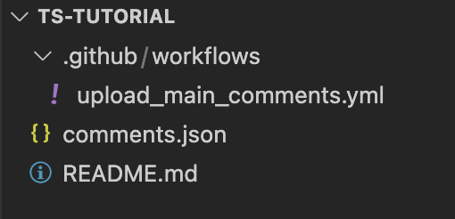
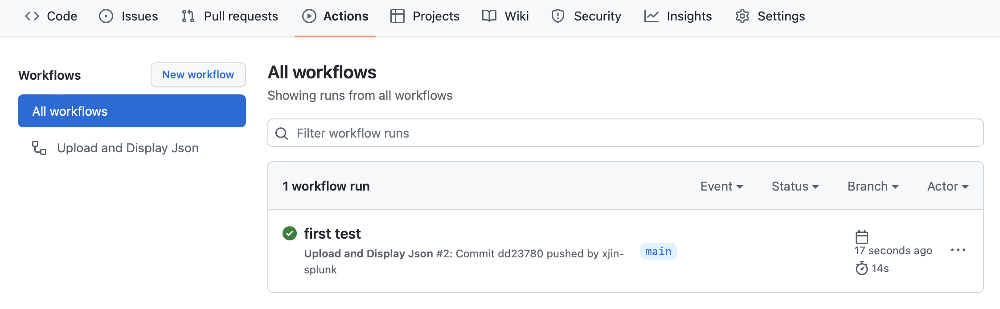
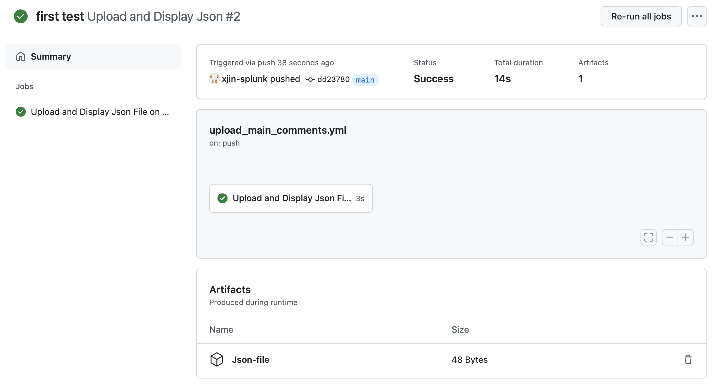
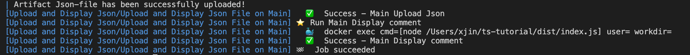
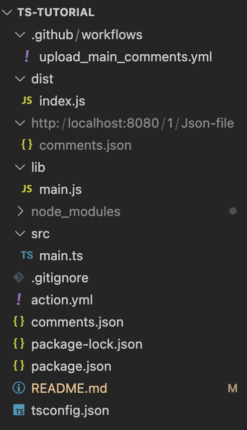
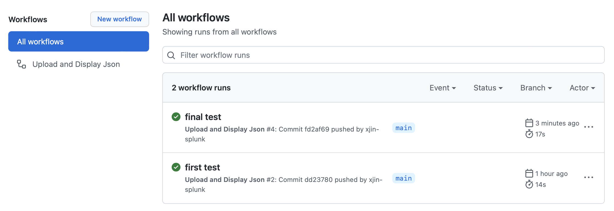
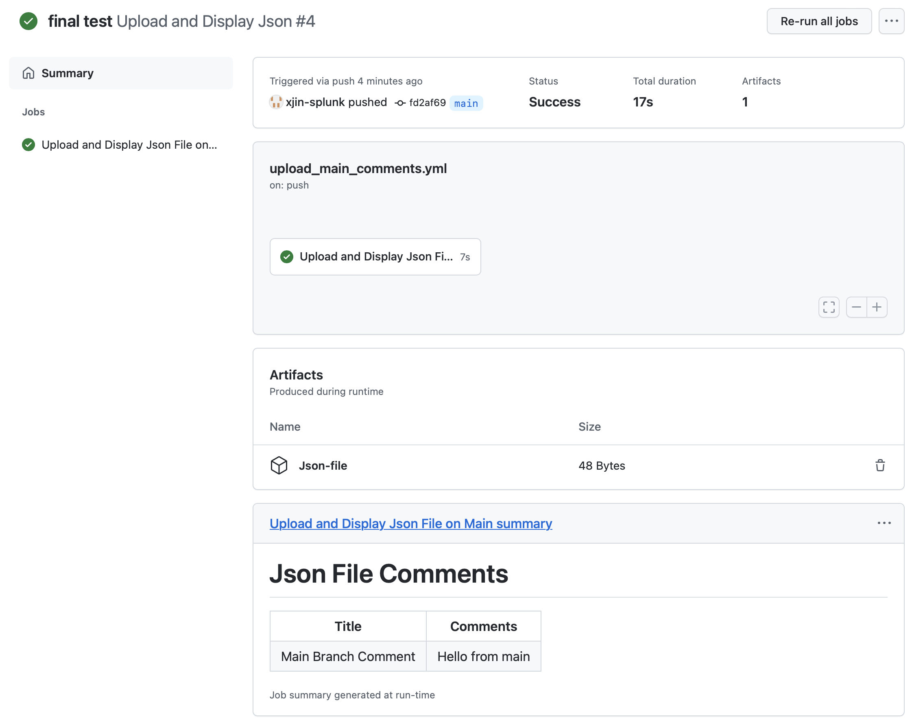
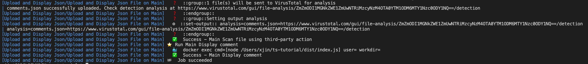
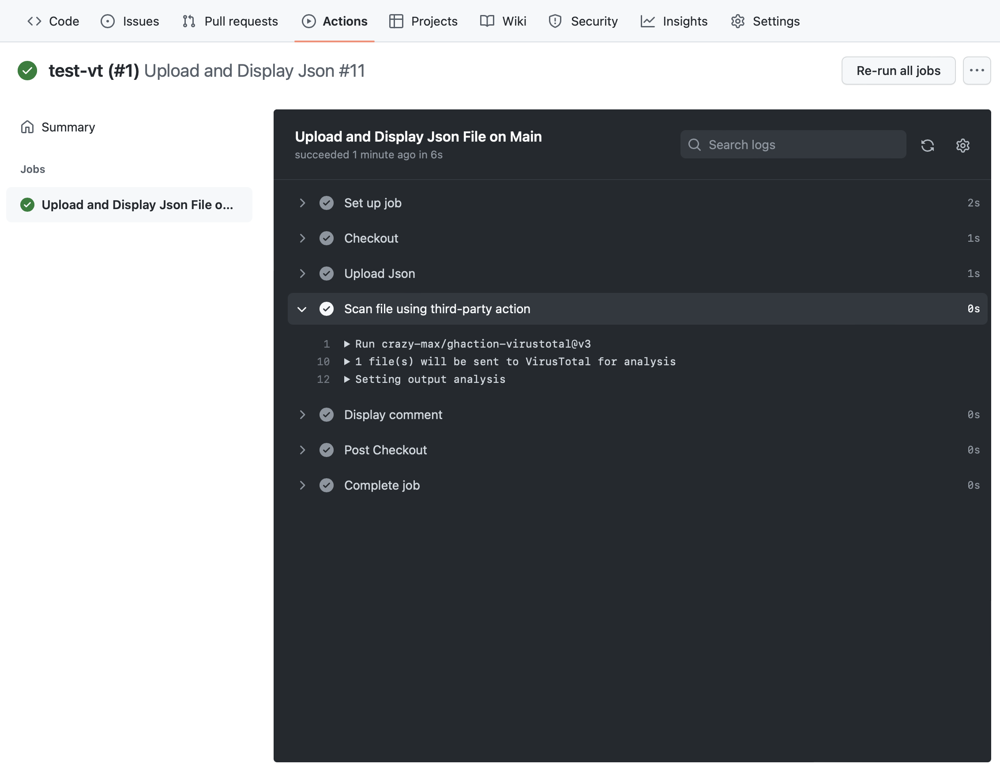

# Develop a Github Actions Project with TypeScript

Table of Contents:
- [Github Actions](#github-actions)
- [Test on GitHub Actions](#test-on-github-actions)
- [Test on Local Machines](#test-on-local-machines)
- [Write Actions with TypeScript](#write-actions-with-typescript)
- [Use Third-Party Actions](#use-third-party-actions)

# Github Actions 

Github Actions is a powerful CI/CD tool that nicely integrates with Github which allows you to write and share action tasks easily. You can find more information at [Github Actions](https://docs.github.com/en/actions). In this tutorial, we will go over how to upload a json file to Github Actions and display the contents on Github Actions with Typescript. 

1. First, let's [create a new git repository](https://docs.github.com/en/get-started/quickstart/create-a-repo) for this project and make a copy/clone of it on your local machine. 

2. Then, create a `comments.json` in the repo folder with comments like below:
```
{
    "Main Branch Comment": "Hello from main"
}
```

3. In your local git repo, create a workflow `yaml` file at `.github/workflows/upload_main_comments.yml` (you may need to create this path yourself). 

The path `.github/workflows/` is the default path that Github Actions looks for, and `upload_main_comments.yml` defines when and what tasks should be run. You can create multiple `.yml` files for multiple workflows (e.g. one for CI and one for test), but for simplicity, we will only create one workflow in this tutorial.

4. In `upload_main_comments.yml` file, type in the following:

```
# name of the worklow
name: Upload and Display Json

# only run this workflow "on" the condition when there is a "push" on "main" branch.
on:
  push:
    branches:
      - "main" 

# define list of "jobs" in the current workflow 
jobs:
  Upload-Display-Json: # name of the current job
    runs-on: ubuntu-latest  # environment 
    name: Upload and Display Json File on Main

    # define each "steps" of the current job
    steps:
        # name of the first step is "Checkout", which "uses" an existing 
        # task from "actions/checkout@v2" that pulls this repo into work space. 
        # "@v2" is the requried version tag.
        # You can find more pre-defined actions here: 
        # https://github.com/actions/
      - name: Checkout
        uses: actions/checkout@v2

        # name of the second step is "Upload Json", which uploads a give file
        # use the keyword "with" to specify the path of the file
      - name: Upload Json
        uses: actions/upload-artifact@v2
        with:
          name: Json-file
          path: comments.json
```

# Test on GitHub Actions

4. Next, let's push everything(`.github/workflows/upload_main_comments.yml` and `comments.json`) to Github. In your git repo, under `Actions` icon, you should be able to see a workflow running with the same name as your commit message. If everything compiles succesfully, `comments.json` should be successfully uploaded to Github Actions.

File Hierarchy:
<p align="center">

<p  >

Github Actions Result:
<p align="center">


<p  >

You can click into the workflow to see more details about each step in job.

# Test on Local Machines

As a developer, testing a project on server is extremly inefficient, and it will be much nicer if we can test it on our local machines where we can get immediate feedback.

5. To test Github Actions on local machines, we will use an open source software call `act` (https://github.com/nektos/act). It provides CLI that allows you to run Github Actions right in your terminal. Simply follow the [instructions](https://github.com/nektos/act) to install it.

6. To test our workflow, use the following command to run it locally using `act`(make sure you are in the root folder of your program/git repo). The command simulates a git `push` that triggers our main branch workflow, and set up a local host to upload the json file.
```
$ act --artifact-server-path http://localhost:8080/ push
```

If everything goes successfully, you should be able to see outputs in terminal that are similar to that in Github Actions. You will also see a folder with name `http:` created by `act` that contains the `json` file we just uploaded (since this is only for testing purpose, you may not want to push this folder and file to your Github repo).


# Write Actions with TypeScript

## Setup work environment
Now, let's write our Action pipeline with [TypeScript](https://www.typescriptlang.org). TypeScript is essentially JavaScript with variable types. Becasue Github can only run JavaScipt, we will need to compile TypeScript into JavaScript, which can be done in just one line of code and we will cover it later. To setup work environment for JavaScript programs, we will use [Node.js](https://nodejs.dev) which allows us to run JavaScrupt program outside of the browsers.

## Prerequisite: 

To initialize a Javascript program, we will use the Node.js package manager `npm`. Follow this link to install [Node.js](https://nodejs.dev).

Then, install TypeScript using following command:
```
$ npm install typescript --save-dev
```

7. First, run the following command and follow the instructions to initialize a project's `package.json` file that contains the description, author, dependencies of the program.
```
$ npm init
```
You should see a `package.json` file created in your work space. 

8. Then, type in the following two commands to add essential dependencies to `package.json`.

```
$ npm install --save-prod @actions/github @actions/core
$ npm install --save-dev @vercel/ncc typescript prettier
$ npm i --save-dev @types/node
```

You can double check that `dependencies` section in `package.json` should have been updated, and `package-lock.json` file and `node_modules` folder are created. `package-lock.json` file descibes the exact dependency tree, and `node_modules` contains the actual packages. Thus, anyone with the same `package.json` and `package-lock.json` file should be able to recreate the exact work environment that you had by running `$ npm install` .

## Write TypeScript Prorgam

9. Now, let's write some TypeScript. Create a new file `src/main.ts` and type in the following code:
```
// import fs package that allows us to access the file system
const fs = require("fs");


// Create markdown message from the json file 
  function createMessage(filename: string) : any[] {
  // read the file
  const jsonFile = fs.readFileSync(filename);

  // parse json file
  const jsonMsg = JSON.parse(jsonFile);

  // create the message
  let message: any[] = [[{data: 'Title', header: true}, {data: 'Comments', header: true}]];
    
  // add json message to the table
  for(const key in jsonMsg) {
    const value = jsonMsg[key];
        
    message.push([`${key}`, `${value}`]);
   }

  return message;
}

// read from json file and log the message
const message = createMessage("comments.json");   // hard code the filename
console.log(message);
```

10. Now, we need to compile the TypeScript file and merge all dependecies into a single JavaScript file. We can do so by adding the following scripts in the `scripts` section in the `package.json` file:
```
"scripts": {
    "build": "tsc && ncc build lib/main.js",
    "format": "prettier --write **/*.ts"
}
```

and create a config file `tsconfig.json` for `tsc` command:
```
{
  "compilerOptions": {
    "target": "es6",
    "module": "commonjs",
    "outDir": "./lib",
    "rootDir": "./src",
    "strict": true,
    "noImplicitAny": false,
    "esModuleInterop": true
  },
  "exclude": ["node_modules"]
}
```

11. Now, run the following command to compile the TypeScript program:
```
$ npm run build
```

This should translate the TypeScript program we just wrote to a `.js` file at `lib/main.js` and merge all dependencies to a single JavaScript file at `dist/index.js`. 

Then, run the actual Javascript program at `dist/index.js` using nodeJS:
```
$ node dist/index.js
```
You should also see the following messega printed in the terminal:
```
[
  [
    { data: 'Title', header: true },
    { data: 'Comments', header: true }
  ],
  [ 'first comment in main branch', 'Hello from main' ]
]
```

Here, we just ran a JavaScript program locally with node.js. For most of more complicated Github Actions tasks, we may not be able to run it with node.js.

12. In reality, we do not want to hard code the file name, but instead, we should pass in the file name through actions. So, first comment out the last two lines in the `src/main.ts`. Then, add the following to the end:
```
// get essential packages
const core = require("@actions/core");
const github = require("@actions/github");

async function run() {
    // get filename and read the message
    const filename = core.getInput("json_file");
    const message = createMessage(filename);

    // create message table with job summaries
    // https://github.blog 2022-05-09-supercharging-github-actions-with-job-summaries/
    await core.summary
    .addHeading('Json File Comments')
    .addTable(message)
    .write()

}

run();
```

Don't forget to recompile the program:
```
$ npm run build
```

13. Let Github know about our new action by creating a `action.yml` file with following content:
```
name: 'Show Comments in Actions'
inputs:
  json_file:
    description: 'Where to find the json output of the comments'
    required: true
    default: 'comments.json'


runs:
  using: 'node12'
  main: 'dist/index.js'
```

We also need to add a new step in `upload_main_comments.yml` file:
```
      - name: Display comment
        # Use the action defined in this repository
        uses: ./
        with:
          json_file: "comments.json"
```

14. Now, let's test it again on local machine. 
```
$ act --env GITHUB_STEP_SUMMARY=[PATH-TO-A-FILE] --artifact-server-path http://localhost:8080/ push
```

The flag `GITHUB_STEP_SUMMARY=[PATH-TO-A-FILE]` gives a path of a local file, which is a way to get around with [Job Summaries in act](https://github.com/nektos/act/issues/1187). You can simply use the path to the `json` file we just uploaded 
$ `act --env GITHUB_STEP_SUMMARY=./http:/localhost:8080/1/Json-file/comments.json --artifact-server-path http://localhost:8080/ push` since it will not modify the file itself.

Sample terminal results when testing locally:
<p align="center">

<p  >

15. Before we test it again on Github Actions, there are some files we do not want to push to Github, so let's wirte a `.gitignore` to omit those files. Create a `.gitignore` file and type in the following
```
# local server folder created by act
http:/
# node pakcages
node_modules/
# macOS Cache file
.DS_Store
```


16. Finally, let's run it on Github Actions. Push everything to Github, and go to Github Actions to checkout the results.

File Hierarchy:
<p align="center">

<p >

Github Actions Result:
<p align="center">


<p  >


# Use Third-Party Actions

There are numerous amazing Actions developed by people in Github community. Here, we will show how we can utilize some of them in our own project. One example is the [virusTotal](https://github.com/crazy-max/ghaction-virustotal) software that provides free virus scanning on Github Actions. We can plug it into our own workflow before we read `comments.json` file to check the security of the file.

## Git Secrets and Personal Access Tokens

17. In order to use virusTotal software, we will need to apply a [virusTotal API key](https://developers.virustotal.com/reference/overview#authentication) first. Follow the link and save your API key to somewhere safe. 

18. Then, add this API key to your git repo. You can learn how to [add a new Github secret here](https://docs.github.com/en/actions/security-guides/encrypted-secrets). The benefit of Github Secrets is that you can conveal your private API by replacing it with `secrets.YOUR_SECRET_NAME` for security purpose.

19. Next, we will need to create a [Personal Access Token](https://github.com/settings/tokens) for authentication purpose. You can follow the [link here](https://docs.github.com/en/authentication/keeping-your-account-and-data-secure/creating-a-personal-access-token) to create a Personal Access Token. Note that your Personal Access Token will only appear once after it is created. Make sure you save it to somewhere safe (but you can always make a new one if you accidentally lost it).

## Add a new step in `yml` file

20. Type in the following script between `Upload Json` step and `Display comment` step in `upload_main_comments.yml`:
```
# use third-party actions to upload and virus-scan a file 
- name: Scan file using third-party action
  uses: crazy-max/ghaction-virustotal@v3
  with:
    vt_api_key: ${{ secrets.VT_API_KEY }}   # virusTotal Api Key
    files: comments.json                    # path to the file you want to scan
```

When this step gets ccompiled on Github Actions, Github will replace `secrets.VT_API_KEY` by the API key that you stored earlier in current repo secret. Make sure names match exactly here and in your repo secret.

21. To pass in `vt_api_key`, add following to `action.yml` file under `input` section:
```
vt_api_key:
  description: 'virusTotal API token'
  required: true  
```

22. Let's first test it locally:
```
$ act --env GITHUB_STEP_SUMMARY=comments.json --artifact-server-path http://localhost:8080/ --secret VT_API_KEY=[YOUR_VT_API_KEY] --secret GITHUB_TOKEN=[YOUR_GIT_TOKEN] push
```

In order to run this workflow locally, we will use `--secret` flag to pass in `VT_API_KEY` and `YOUR_GIT_TOKEN`. Don't forget to replace `[YOUR_VT_API_KEY]` and `[YOUR_GIT_TOKEN]` by your own virusTotal API key and github personal token.

In your terminal, you should be able to see something like this:

<p align="center">

<p >

You can follow the virusTotal link to checkout your scanning results.

23. Finally, push everything to Github. Go to `Actions` to checkout the results.

<p align="center">

<p >


